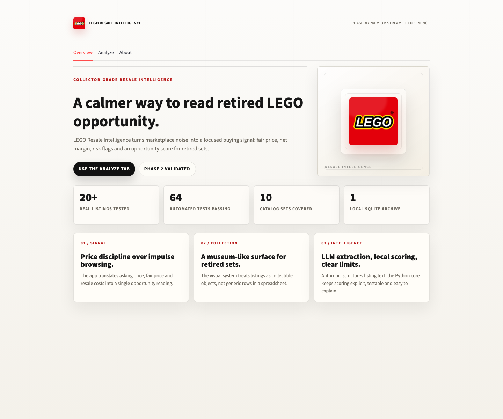
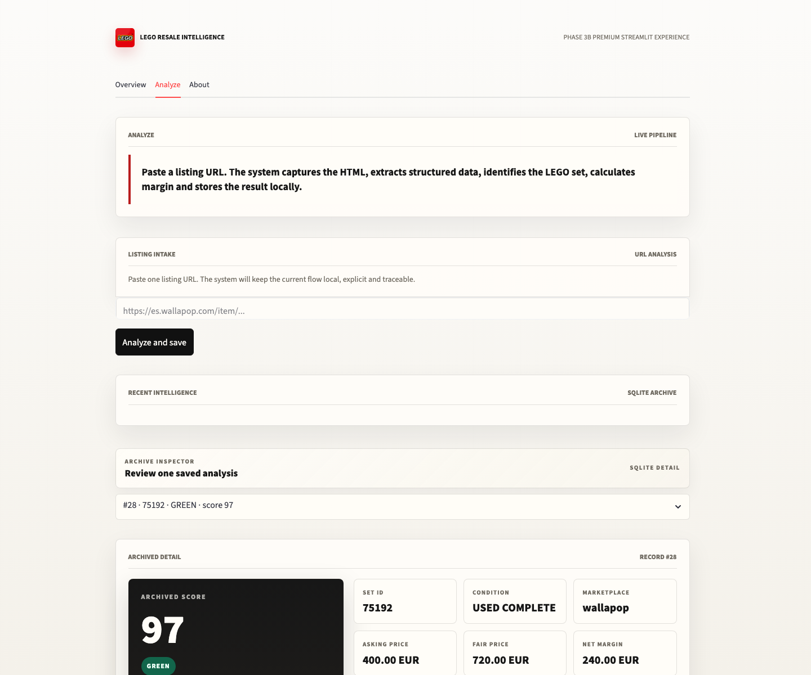
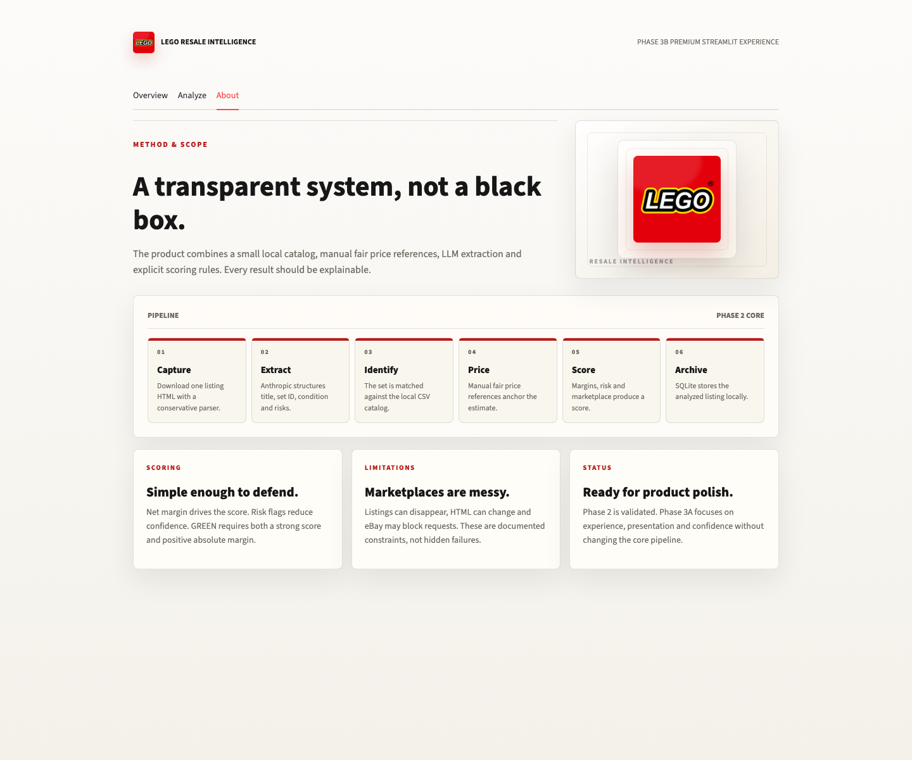
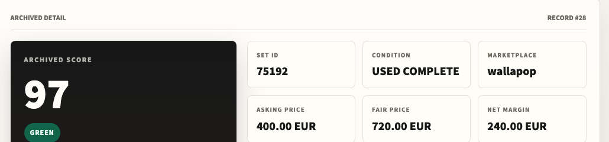
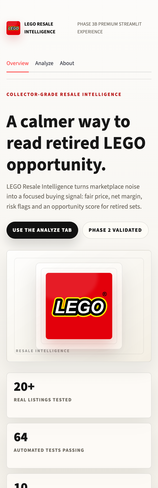
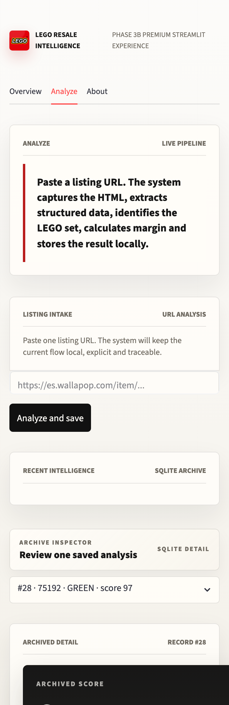
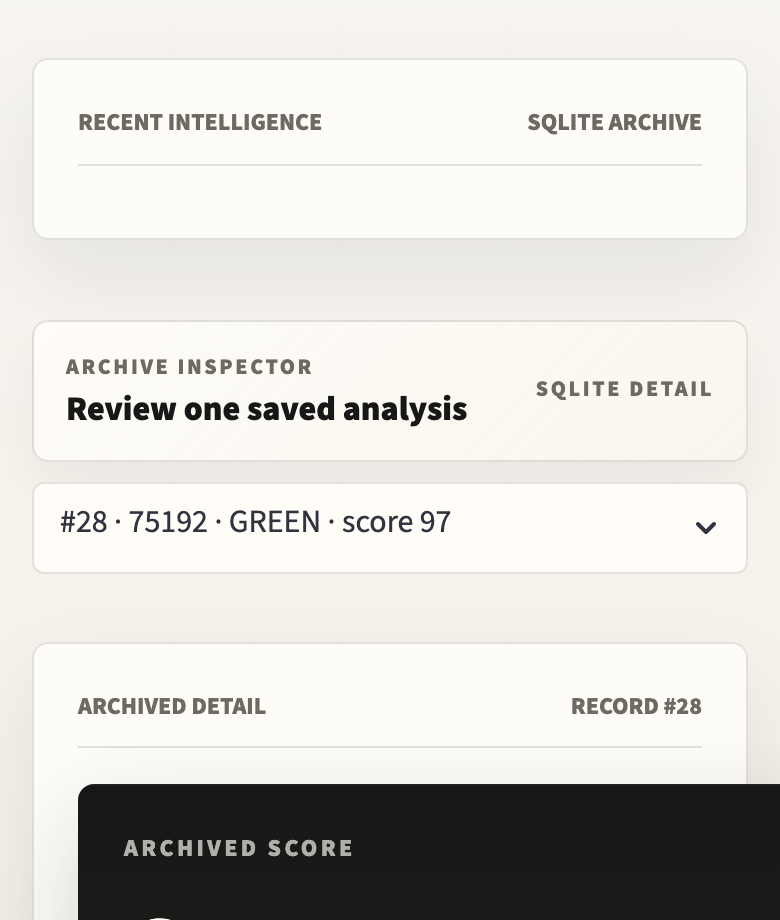

# LEGO Resale Intelligence

A personal e-commerce intelligence tool that turns LEGO marketplace listings into structured buying signals: fair price, net margin, risk flags, portfolio P&L and market context. V1 is a stable Streamlit product; V2 expands it with FastAPI, Next.js and a seed-backed intelligence layer.

> **Portfolio project** — built to demonstrate product engineering, LLM integration and UI polish without over-engineering the architecture.

---

## V2 status

V1 is the stable Streamlit product. V2 is an incremental expansion in the same repo, not a rewrite.

V2 adds:

- FastAPI backend in `backend/`
- Next.js frontend in `frontend/`
- dynamic pricing seed data
- set-level intelligence with price history charts
- portfolio P&L views
- local market briefings
- shared SQLite watchlist workflow
- premium Linear/Stripe-inspired 2D UI with restrained LEGO cues

Data provenance note:

- the active V2 catalog currently contains 50 sets;
- external verification is tracked separately in `data/catalog_active_research.json`;
- 50 sets have been audited in DATA-1;
- DATA-2 normalized evidence-backed catalog mismatches;
- DATA-3 applied a conservative canonical-source policy for minor source disagreements;
- DATA-4 resolved two of the three remaining material conflicts with additional Brickset/BrickEconomy evidence;
- 49 sets are externally verified under the current app rules, and 1 remains blocked because sources disagree materially with the seed catalog.

Current V2 progress:

- Demo local: **99/100**
- Full guide: **98/100**

Start V2 locally:

```bash
# Terminal 1
bash scripts/v2_start_api.sh

# Terminal 2
bash scripts/v2_start_frontend.sh
```

Open:

- V2 web: `http://127.0.0.1:3000`
- V2 API docs: `http://127.0.0.1:8000/docs`

Check V2:

```bash
bash scripts/v2_doctor.sh
```

V2 documentation:

- [`docs/v2/README.md`](docs/v2/README.md)
- [`docs/v2/demo_runbook.md`](docs/v2/demo_runbook.md)
- [`docs/v2/release_checklist.md`](docs/v2/release_checklist.md)
- [`docs/v2/portfolio_story.md`](docs/v2/portfolio_story.md)
- [`docs/v2/deploy_plan.md`](docs/v2/deploy_plan.md)
- [`docs/v2/publish_manual_for_juan.md`](docs/v2/publish_manual_for_juan.md)
- [`docs/v2/final_handoff.md`](docs/v2/final_handoff.md)
- [`docs/v2/guide_gap_analysis.md`](docs/v2/guide_gap_analysis.md)
- [`docs/v2/postgres_alembic_notes.md`](docs/v2/postgres_alembic_notes.md)
- [`docs/v2/db_read_fallback_notes.md`](docs/v2/db_read_fallback_notes.md)
- [`docs/v2/data_quality_notes.md`](docs/v2/data_quality_notes.md)

---

## Public V2 Demo

- Web app: [https://lego-resale-ntelligence.vercel.app](https://lego-resale-ntelligence.vercel.app)
- API health: [https://lego-resale-ntelligence-production.up.railway.app/health](https://lego-resale-ntelligence-production.up.railway.app/health)
- Data quality: [https://lego-resale-ntelligence-production.up.railway.app/api/market/data-quality](https://lego-resale-ntelligence-production.up.railway.app/api/market/data-quality)

The public V2 demo runs as a split deployment: FastAPI on Railway and Next.js on Vercel.

---

## V1 Streamlit Demo

🔗 [https://lego-resale-ntelligence-gybrigvpvh9aa9epszcdul.streamlit.app](https://lego-resale-ntelligence-gybrigvpvh9aa9epszcdul.streamlit.app)

### Deploy to Streamlit Community Cloud

1. Push this repo to GitHub (make sure `.env` and `db/lri.db` are in `.gitignore` — they already are)
2. Go to [share.streamlit.io](https://share.streamlit.io) → **New app**
3. Set the main file path to: `app/main.py`
4. Under **Advanced settings → Secrets**, paste:
   ```toml
   ANTHROPIC_API_KEY = "your_key_here"
   ANTHROPIC_MODEL = "claude-haiku-4-5-20251001"
   ```
5. Deploy — the app will be live at `https://your-app-name.streamlit.app`

> **Note on persistence:** The SQLite archive is ephemeral on Streamlit Cloud — analyses won't survive redeploys. This is expected for a portfolio demo; for a persistent version, swap `DATABASE_URL` for a hosted Postgres instance.

---

## What It Does

V1 lets you paste a Wallapop or eBay listing URL. The system:

1. Downloads the listing HTML
2. Extracts structured data (title, set ID, condition, risks) via Anthropic
3. Matches the set against a local catalog
4. Looks up a manual fair price reference
5. Calculates gross margin, net margin and selling fees
6. Produces an opportunity score (0–100) with a GREEN / AMBER / RED category
7. Persists the result to a local SQLite archive
8. Displays everything in a clean, premium Streamlit interface

V2 adds a product-grade web layer:

1. Market overview with seeded price history
2. Set intelligence and price charts
3. Watchlist workflow
4. Portfolio P&L
5. Research queue and active evidence audit log
6. Local analyst briefings with Claude fallback architecture
7. Deploy-ready FastAPI + Next.js split

---

## Screenshots

| Overview | Analyze | About |
|---|---|---|
|  |  |  |

**Archived score detail**



**Mobile**

| Overview | Analyze | Archive |
|---|---|---|
|  |  |  |

---

## Architecture

V1 remains intentionally compact and explainable.

```
URL
 └─▶ capture.py              Download listing HTML (requests + BeautifulSoup)
      └─▶ extract.py         Structure the text via Anthropic (title, set ID, condition, risks)
           └─▶ identify.py   Match against data/catalog.csv
                └─▶ pricing_reference.py   Look up manual fair price by set + condition
                     └─▶ scoring.py        Calculate margins, fees and opportunity score
                          └─▶ db.py        Persist result to SQLite via SQLAlchemy
	                               └─▶ app/main.py   Streamlit UI (Overview · Analyze · About)
```

V2 wraps that foundation with API and product surfaces:

```text
backend/main.py
 ├─ /api/analyze      Listing analysis and demo analysis
 ├─ /api/market       Dynamic pricing, trends, data quality, evidence audit
 ├─ /api/watchlist    Shared watchlist workflow
 ├─ /api/portfolio    Portfolio P&L and CRUD
 └─ /api/briefings    Analyst briefing fallback

frontend/
 ├─ Market Overview
 ├─ Analyze
 ├─ Watchlist
 ├─ Sets
 ├─ Research
 ├─ Portfolio
 └─ Briefings
```

**Scoring is explicit, not a black box.**
Net margin drives the score. Risk flags reduce confidence. GREEN requires a strong score AND a positive absolute margin.

```
gross_margin  = fair_price − asking_price
net_margin    = gross_margin − selling_fees − outbound_shipping
```

---

## Stack

| Layer | Technology |
|---|---|
| Language | Python 3.11 |
| V1 UI | Streamlit + custom CSS/HTML |
| V2 UI | Next.js + TypeScript |
| V2 API | FastAPI |
| LLM | Anthropic (`claude-haiku-4-5`) |
| Data modeling | Pydantic v2 |
| Persistence | SQLite/Postgres-ready SQLAlchemy |
| HTML capture | requests + BeautifulSoup |
| Testing | pytest |
| Config | python-dotenv |

---

## Test coverage

```
116 passed
```

Tests cover: data models, capture, extraction mocks, catalog matching, pricing lookups, scoring logic, margin calculations, database operations, FastAPI routes, dynamic pricing, DB-backed seed loading, seed data validation, data quality API, catalog research queue, portfolio logic (including CRUD), Claude Sonnet briefings with local fallback, expanded price history for all 50 active seed sets, and watchlist workflows.

---

## Local setup

```bash
# 1. Clone and create virtual environment
git clone https://github.com/YOUR_USERNAME/lego-resale-intelligence.git
cd lego-resale-intelligence
python -m venv .venv && source .venv/bin/activate

# 2. Install dependencies
pip install -r requirements.txt

# 3. Configure environment
cp .env.example .env
# Add your ANTHROPIC_API_KEY to .env

# 4. Run V1
streamlit run app/main.py
```

Open `http://localhost:8501`

Run V2:

```bash
bash scripts/v2_start_api.sh
bash scripts/v2_start_frontend.sh
```

Open `http://127.0.0.1:3000`

### Environment variables

```env
ANTHROPIC_API_KEY=your_key_here
ANTHROPIC_MODEL=claude-haiku-4-5-20251001   # optional, this is the default
DATABASE_URL=                                # leave empty to use db/lri.db
```

### Run tests

```bash
pytest
```

---

## Catalog Coverage

V1 supports 10 manually priced reference sets.

V2 contains 50 active catalog rows and 250 seed price snapshots. The app now separates seed/demo coverage from external verification, so it should be described as partially verified rather than fully verified live market data.

Current V2 evidence status:

- `active_catalog_verified_sets: 49`
- `active_catalog_verified_pct: 98.0`
- `active_catalog_evidence_started_sets: 50`
- `active_catalog_blocked_sets: 1`
- `market_data_source_status: partially_verified`
- evidence file: `data/catalog_active_research.json`

Final `10220` decision:

- `10220` Volkswagen T1 Camper Van remains intentionally under review;
- Brickset, BrickRanker and BrickEconomy materially disagree on lifecycle and piece-count assumptions;
- the app keeps this single set as seed/demo rather than forcing a weak verification claim.

---

## Known limits

These are documented constraints, not hidden failures.

- **V2 market data is seed/demo** — the app now labels this explicitly and tracks external evidence separately.
- **49/50 active sets are externally verified** — `10220` remains intentionally under review.
- **HTML parsing is basic** — marketplaces can change page structure; this is a known fragility.
- **eBay may block requests** — 403 errors are an external constraint, not a bug.
- **Score is explainable, not financial advice** — every signal is visible and traceable.
- **No real-time pricing** — fair prices are manually set references, not live market data.

---

## Validation

Tested against 20+ real Wallapop and eBay URLs. 13 completed the full pipeline end-to-end; 7 failed due to external marketplace constraints (404s, 403 blocks, removed listings) — all documented.

Full validation notes: [`docs/phase_2_validation.md`](docs/phase_2_validation.md)

---

## Project context

Built as a personal portfolio project to demonstrate:

- **End-to-end product thinking** — from raw marketplace HTML to a scored, archived buying signal
- **LLM integration** — structured extraction with Anthropic, explicit fallback handling
- **Explainable scoring** — every number is traceable; no magic
- **UI polish** — premium Streamlit V1 and Linear/Stripe-inspired Next.js V2
- **Honest scope** — a working V1, an expanded V2, and clear evidence limits before public claims

---

_Personal educational project. Not affiliated with or endorsed by the LEGO Group._
